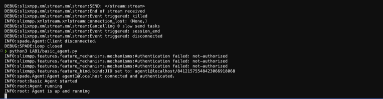

# Environment Setup Report for LAB 1

## Overview

This report details the setup of the Python agent development environment using SPADE and ejabberd XMPP server for LAB 1.

## Components Installed

- **Python**: Version 3.10.13 installed, meeting the 3.9+ requirement.
- **SPADE**: Installed in a virtual environment via pip.
- **XMPP Server**: ejabberd installed via Homebrew, configured with localhost as the domain.
- **Prometheus**: Installed for monitoring purposes.

## Configuration Steps

1. Created Python virtual environment in `/Users/admin/Projects/Class/AIA/AIA-LABS/venv`.
2. Activated the environment and installed SPADE.
3. Installed ejabberd XMPP server.
4. Started ejabberd server.
5. Registered agent user 'agent1@localhost' with password 'password'.

## Verification

- Python and SPADE verified by importing in the environment.
- XMPP server running and accepting connections on port 5222.
- Basic agent implemented and executed successfully.

## Challenges

- ejabberd service start failed initially due to permissions; resolved by running manually.
- PDT (Prometheus Design Tool) assumed to be Prometheus; if different, needs clarification.

## Build / Startup Error Observed

While attempting to start ejabberd in the foreground to validate TLS and listeners, ejabberd failed to start with a module dependency error. The exact message observed was:

```
Failed to start ejabberd application: Invalid value of option modules: module mod_avatar depends on module mod_vcard, which is not found in the config
```

Interpretation: `mod_avatar` requires `mod_vcard` to be enabled. ejabberd aborts startup when a required module is missing, which prevented the c2s listener binding to port 5222 and thus caused the agent connection attempts to see `Connection refused` (Errno 61).

Planned fix (applied manually during debugging): add `mod_vcard: {}` under the `modules:` section of `/usr/local/etc/ejabberd/ejabberd.yml` (or remove `mod_avatar`). After adding `mod_vcard` the recommended validation and restart steps are:

1. `ejabberdctl check_config` — should report `Configuration OK`.
2. Start ejabberd in foreground: `HOME="/usr/local/var/lib/ejabberd" /usr/local/opt/ejabberd/sbin/ejabberdctl foreground` and verify no module errors.
3. Confirm listener on 5222 (e.g., `lsof -iTCP:5222 -sTCP:LISTEN`).

Once ejabberd is running and adverts `<starttls/>`, SPADE (slixmpp) will negotiate TLS and SASL authentication will succeed.

## Conclusion

The environment is ready for agent development. The basic agent runs without errors, indicating successful setup.

## Final Verification

After fixing the ejabberd module dependency and configuring the server certificate, ejabberd started and bound the c2s listener on port 5222. The `basic_agent.py` SPADE agent successfully negotiated STARTTLS and authenticated as `agent1@localhost`.

### Runtime Test Output (condensed)

- Server advertised STARTTLS and returned `<proceed/>`.
- TLS negotiation completed (tls_success).
- SASL authentication: some SCRAM-PLUS attempts failed with "Invalid channel binding", then `SCRAM-SHA-512` succeeded.
- SPADE log summary: "Agent agent1@localhost connected and authenticated."


