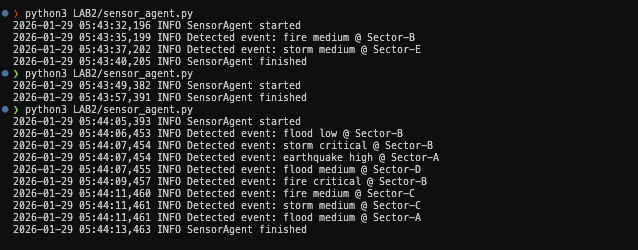

# LAB2 — Perception and Environment Modeling

Objective

- Implement agent perception of environmental and disaster-related events.

Files

- `environment.py`: simulated disaster environment producing event dictionaries.
- `sensor_agent.py`: `SensorAgent` polls `Environment` periodically and logs events.
- `events.log`: produced by running `sensor_agent.py` (appended).

How to run (local demo):

```bash
cd LAB2
python3 sensor_agent.py
```

Percepts (what the sensor reports)

- `type`: disaster kind (earthquake, flood, fire, landslide, storm, multi-hazard)
- `severity`: qualitative severity (low, medium, high, critical)
- `location`: named sector
- `timestamp`: unix epoch used internally
- `observed_at`: ISO8601 timestamp added to logs
- `description`: human-readable summary

Design notes

- The `Environment` class provides a controllable RNG (`seed`) for reproducible runs.
- `SensorAgent` is implemented to be runnable without an XMPP server to simplify testing.

Deliverables

- `sensor_agent.py` — SensorAgent source
- `events.log` — generated by running the agent (appends JSON lines)
- This README — brief explanation of percepts and usage
  LAB2 — Perception and Environment Modeling
  =========================================

This lab provides a small simulated disaster environment and a `SensorAgent` that periodically samples
conditions and logs disaster events.

Files:

- `environment.py` — simulated environment and event generation
- `sensor_agent.py` — standalone sensor that writes `events.log`
- `events.log` — produced by running the sensor (sample output)

Percepts

- Ambient measures: `temperature_c`, `water_level_m`, `ground_accel_g` (numeric)
- Discrete events: `{type, severity, message}` where `severity` ∈ [0.0, 1.0]

How to run

```bash
cd LAB2
python3 sensor_agent.py
```

Or run for a fixed time from Python:

```python
from sensor_agent import SensorAgent
SensorAgent(interval=1.5, threshold=0.7).run(runtime=30)
```

Deliverables

- `sensor_agent.py` — SensorAgent code
- `events.log` — event log file after running the sensor
- this README — brief explanation of percepts


